# 白山云存储控制台操作手册
# 1. 概述
白山云存储控制台系统是面向客户在线使用云存储的管理平台。
该管理平台主要包括以下功能模块：

我的存储：
- 展示用户所有的Bucket。
- 对Bucket进行配置管理。
- 配置图片处理样式。
- Bucket中的对象进行操作。

统计分析：以图表的方式展示各时间段带宽、流量、请求次数、存储空间等数据信息。

视频处理：用户可以创建转码模板、配置自动或主动转码的规则以及查看视频处理的统计分析数据。

秘钥管理：展示用户当前账户的Accesskey和SecretKey。

用户管理：超级用户可以创建子账号并对子帐号赋予相应的权限。

帮助文档：帮助用户使用白山云存储系统的文档。

# 1. 功能特性
## 1. 用户登录
用户登录网站：http://console.bscstorage.com/，输入用户名及密码登录。
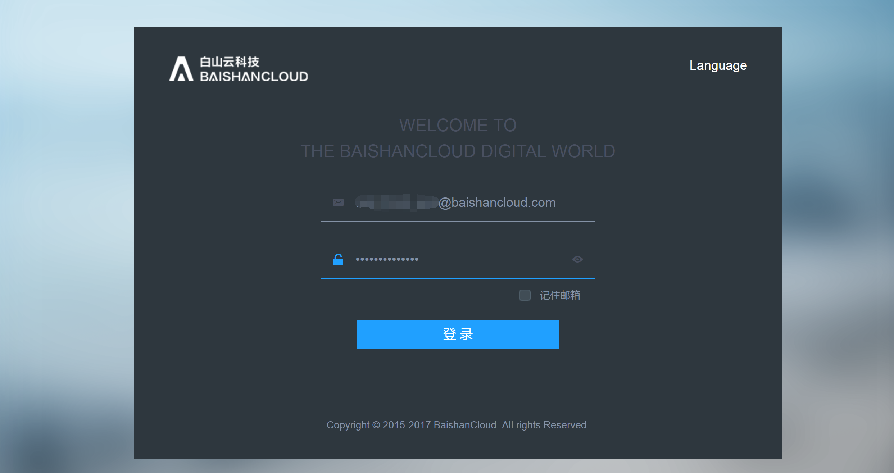
 
在登录操作界面后，右上角可以选择退出登入。
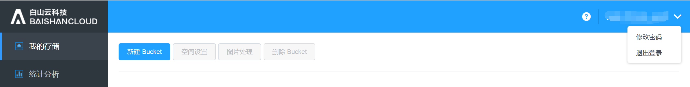

## 1. 我的存储

### 1. 新增Bucket
用户新建Bucket并命名此Bucket。Bucket命名规则:云存储内全局唯一；由小写字母、数字及“-”组成，长度为3~63位;不能以数字、‘-’开头;不能以‘-’开头或结尾。

 
### 1. 空间设置
选中某个Bucket，点击“空间设置”：

空间设置下面有“权限设置”、“图片鉴黄”等；这里的权限设置是对存储空间Bucket进行的权限设置。权限设置可以对某些用户添加权限。

 
### 1. 图片处理
选中某个Bucket，点击“图片处理”进入到图片处理的管理页面。

点击“创建样式”，可以创建新的图片处理样式。
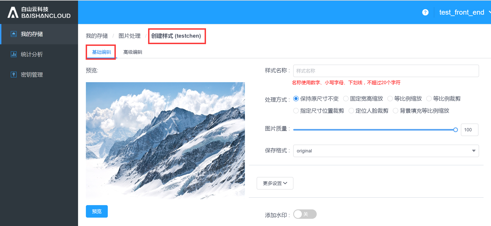

更多设置：

 
高级编辑：

### 1. 文件管理 
双击某个Bucket，进入到管理某个Bucket中的文件或文件夹。

下图为文件管理界面：
此界面内，用户可以在此Bucket中创建/删除文件夹、上传/删除文件，并对文件进行权限管理、下载、获取地址、预览文件等操作。

 
点击“上传文件”可上传本地文件：

 
点击“创建文件夹”可在此Bucket中创建子文件夹：

点击此“下载”可点选指定文件并批量下载：
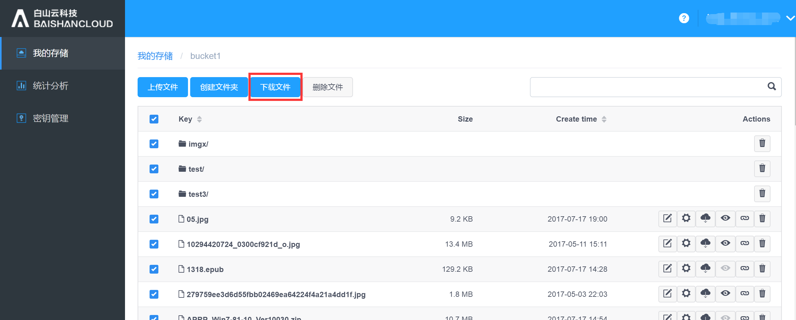

点击此“删除”可点选指定文件并批量删除：

 
点击 “文件重命名”可给文件重命名：

下图为权限设置界面：
允许用户对不同的访问者开放不同的访问/编辑权限。

点击“下载”可将文件下载到本地：
 

点击“预览”可以预览该图片：

点击“获取地址”，可获取此文件的url地址：

点击“删除”可删除选中文件：
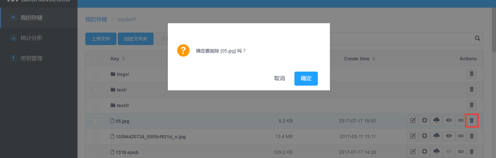

### 1. 删除Bucket
用户可将非空Bucket删除。
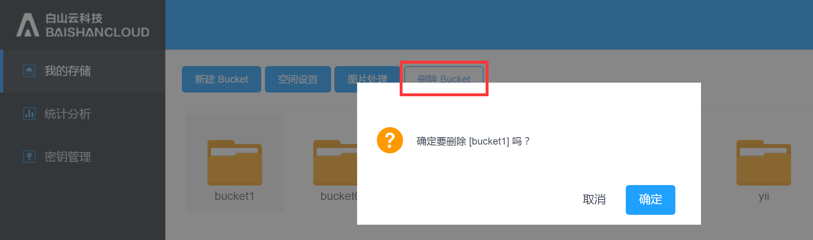

## 1. 统计分析
统计分析：显示的是用户各时段的存储情况，包括带宽、流量、请求次数、存储空间、文件数。
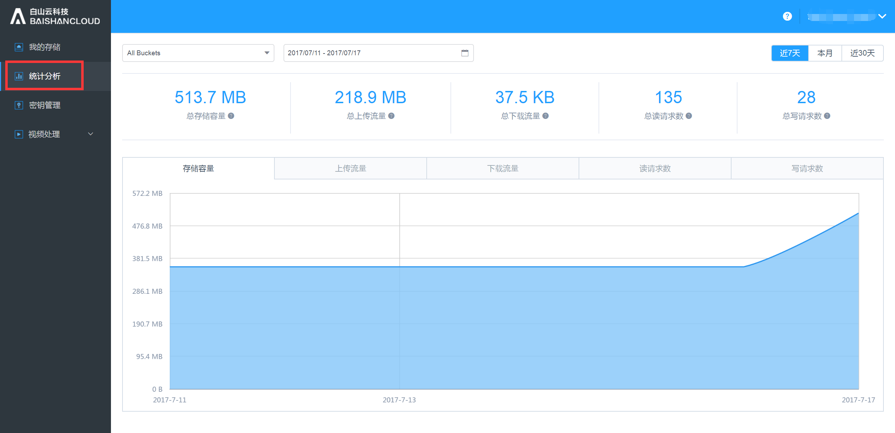
 
用户可选择查看不同空间的存储情况，如下图：
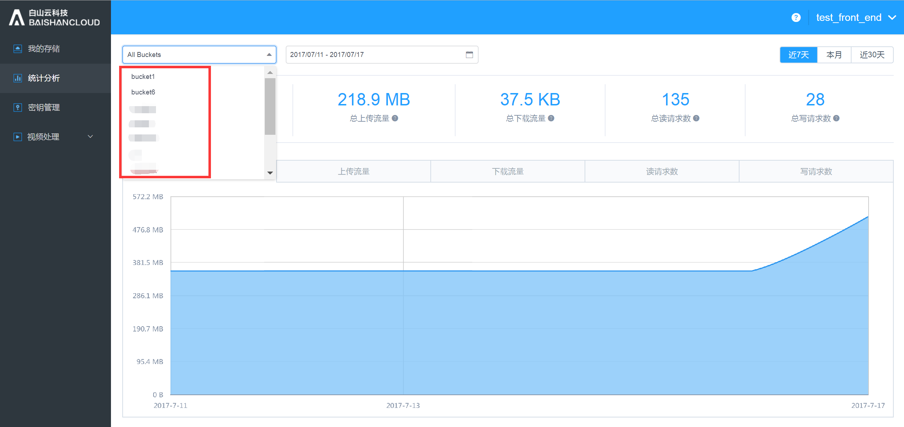

用户可根据需求查看不同数据，如下图：

## 1. 视频处理
### 1. 转码模板
视频模板是由用户预定义的可以重复使用的转码规则。其中主要规定了转码后的封装类型、编码方式、分辨率、码率等多媒体参数。
#### 1. 转码模板管理
您可以在控制台创建转码模板。
点击“转码模板”，进入到转码模板的管理页面。转码模板管理页面上列出了视频转码的基本参数。将鼠标移动至视频、音频区域则可以查看详细参数。
在此页面上，您还可以新建转码模板，点击“新建模板”即可。

 
#### 1. 创建转码模板
点击“新建模板”，
 

“新建模板”的页面如下：
填写“模板名称”、“模板描述”，勾选“输出封装格式”；当输出格式为mp4时，FastStart可以选择开启或关闭，当输出格式不是mp4时，没有FastStart这个选择项。

视频配置参数如下：
当选择的编码是“不变”时，只用填”码率“和”帧率“。
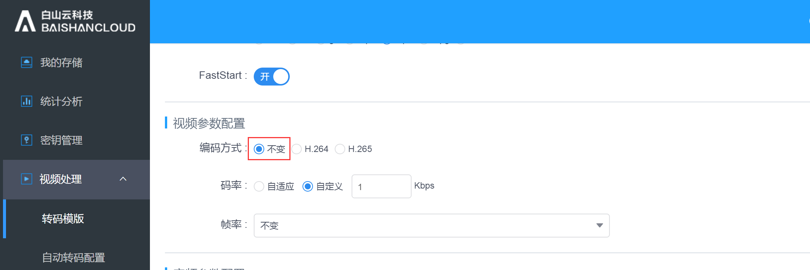

当编码方式选择H.264时，需要选择”编码Profile “、”编码Level“、”固定关键帧间距“、”码率“、”帧率“、”分辨率“、”宽高比“。

当编码方式选择H.265时，需要选择”固定关键帧间距“、”码率“、”帧率“、”分辨率“、”宽高比“。
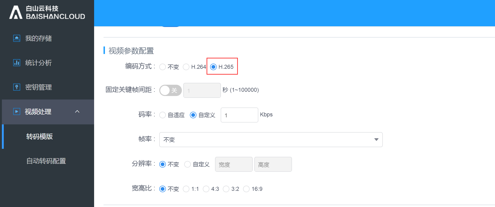

音频配置参数如下： 

### 1. 自动转码配置
自动转码配置适用于以工作流的方式对新上传的文件进行转码。请注意新创建的自动转码配置只对新上传的文件有效，不会对应用于在创建配置之前上传的文件。
点击”自动转码配置“，进入到自动转码配置的管理页面。
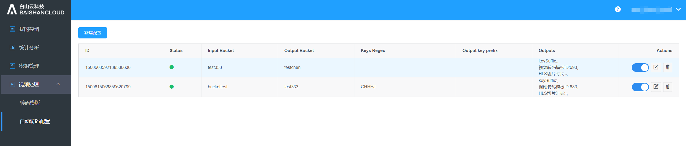

点击”新建配置“，进入到新建配置的页面。
首先您需要配置“允许转码的路径规则”和“输入 Bucket”。对于“允许转码的路径规则”，您可以选择按照文件扩展名或正则表达式的方式输入；按文件扩展名配置路径时，您可以输入多个扩展名（多个扩展名之间使用”|“分割）；路径只能输入一个。

输出配置区：
需要填写输出文件名前缀（可以为空）和输出Bucket。还需要填写输出规则和视频截图规则，输出规则和视频截图规则都可以配置多套。
 

输出规则的配置页面如下：当转码模板是输出的ts格式时，需要选择HLS切片时长；其它普通的输出只需要填写转码模板和输出文件名后缀即可。

 
视频截图的配置页面如下：需填写”输出文件名后缀”、”截图起始时间点“、”截图时间间隔”、“截图最大数量”、“分辨率”和“宽高比”。  
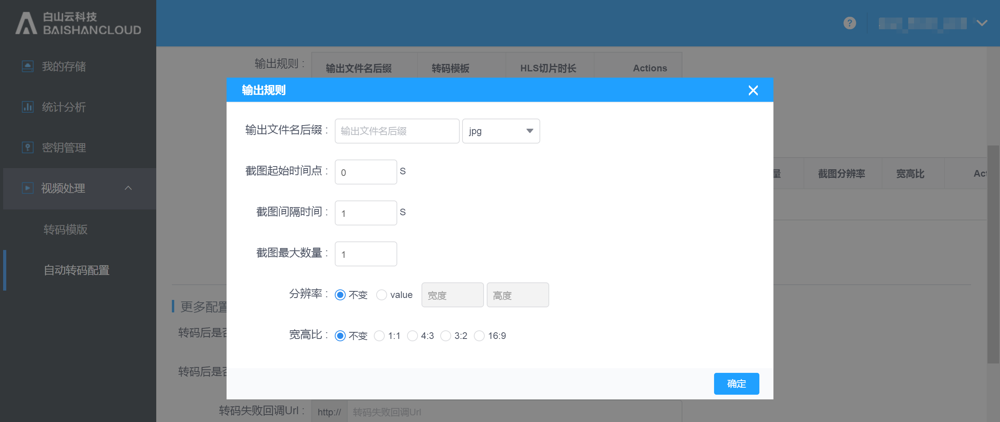

请注意在“输出规则”和“视频截图规则”中至少需要配置其中之一。
当转码模板里有输出ts格式的时候，可以选择是否开启HLS自适应转码，如果开启，需要填写切片格式和MasterPlayList文件名后缀。
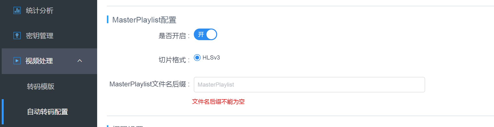
 
在“更多配置”中，您可以配置转码后是否删除原始文件、转码后是否保留原始路径、转码失败回调URL、转码成功回调URL。
权限设置：设置转码输出文件的权限。

## 1. 秘钥管理
查看此账户的秘钥以及创建时间：
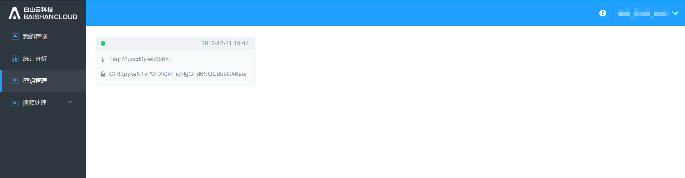

## 1. 用户管理
如果您的账号是超级账号，您可以在控制台创建子帐号，并对子账号赋予相应的权限。

## 1. 帮助文档
帮助用户快速查阅常用问题、要使用的函数、以及函数的用法及介绍 ，包括FAQ，SDK使用的例子，调用接口创建bucket、获取bucket列表、上传文件、下载文件等的例子，以及图片处理等子服务的介绍，图形界面工具上传文件的步骤说明等等。
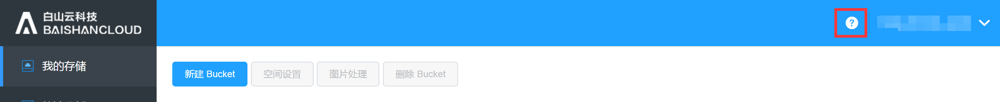
 
下图为帮助文档界面：
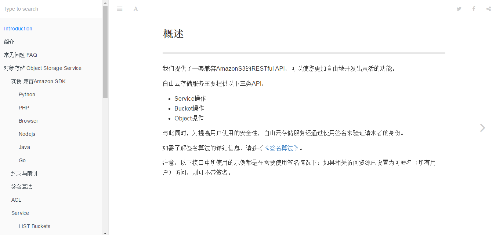

 
各类SDK的使用例子不一一展开详述：

