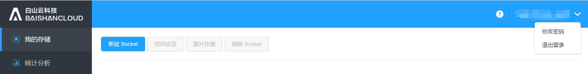
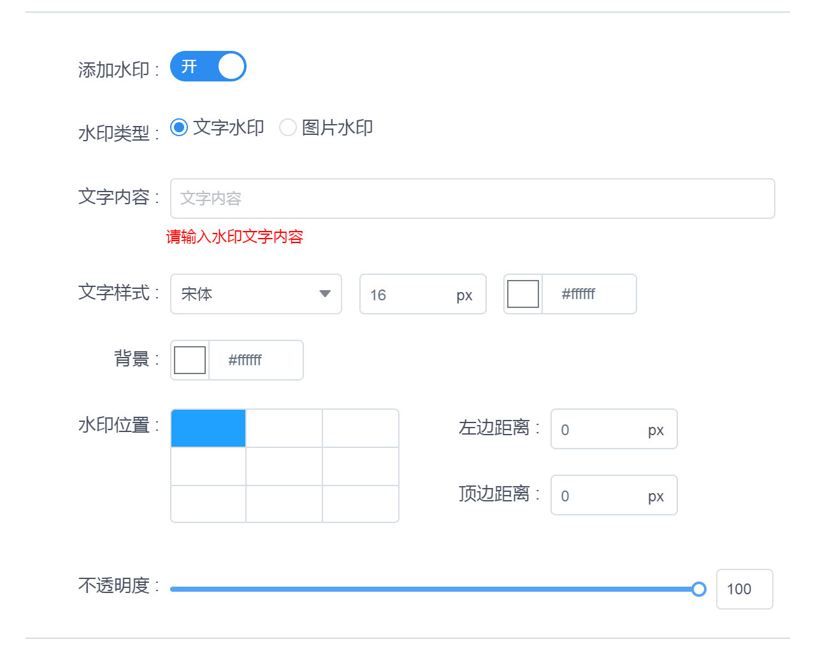
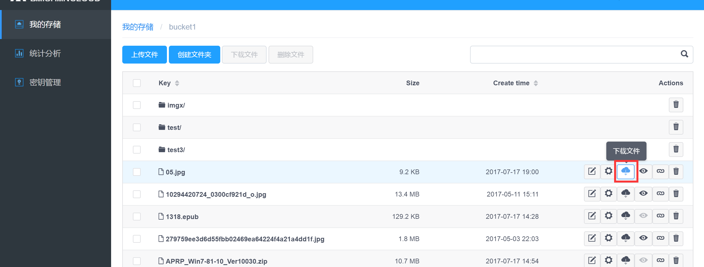
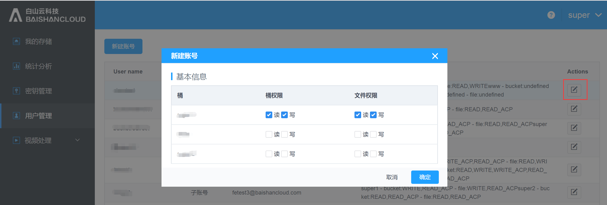

# Baishan Cloud Storage Console User Guide
# 1. Overview

` `Cloud Storage Console is a management platform for customers to use cloud storage online. 

The management platform mainly includes the following functional modules:

` `My Storage:

- Display all user Buckets.
- Configuration management of Bucket. 
- Configure the image processing format. 
- Manage the objects in the Bucket.

Statistical analysis: Graphically display data information for each time period such as bandwidth, traffic, number of requests, storage space, etc. 

Video Processing: Users can create transcoding templates, configure rules for automatic or active transcoding and view statistical analysis data of video processing. 

Secret Key Management: Display the Accesskey and SecretKey of the user's current account.

User management: Main account can create sub-accounts and give corresponding permissions to sub-accounts.

Help documentation: Documentation to help users use the Baishan Cloud Storage console.

# 1.Functional features 
` `## 1. User Login 
Portal URL: <http://cwn-ss.bscstorage.com/>, enter user name and password to log in.

After logging in, you can choose to log out at the upper right corner.

## 1. My Storage

### 1. New Bucket 
User creates a new Bucket and names this Bucket. Bucket naming rules: Unique within the cloud storage account; composed of lowercase letters, numbers or dash symbol '-', length 3~63 digits; cannot start with numbers; cannot start or end with dash symbol '-'.

### 1. Space setting 
Select a Bucket and click on "Space Settings".

Under Space settings, there are "Permissions" and "Sensitive content filtering", etc. This permission setting applies to the storage space bucket, you can also add permission to certain users.

### 1. Image processing 
Select a Bucket and click "Image Processing" to enter the image processing management page.

Click "Create Style" to create a new image processing style.

More settings:

Advanced edit:

### 1. File Management  
Double-click a Bucket to enter to manage the files or folders in a Bucket.

The following shows the file management interface: 
Users can create/delete folders, upload/delete files, and manage permissions, download, get URL addresses, preview files, and perform other operations here.

Click “Upload file” to upload local files:

Click “Create folder” to create a new folder in this Bucket:

Click “Download” to download selected files:

Click “Delete” to delete selected files:

Click “Rename” to rename a file:

Permission setting:
Allow users to grant different access/editing permissions.

Click “Download” to download files to your local folder:
 

Click “Preview” to preview images:

Click “Get URL” to obtain the URL for this file:

Click “Delete” to delete selected file:

### 1. Delete Bucket
Users can delete the non-empty Bucket.

## 1. Statistical Analysis 
Statistical analysis: It shows the storage situation of users at each time period, including bandwidth, traffic, number of requests, storage space, number of files

Users can choose to view the storage data in different spaces:

Users can view use different filters to lookup the data according to their needs, such as “Storage capacity,” “Uploading traffic,” “Downloading traffic,” “Get request count,” “Post request count,”, examples as following:

## 1. Video processing
### 1. Transcoding template
Video templates are transcoding rules that are predefined by users and can be reused. Among them, parameters such as the packaging type, encoding method, resolution, and bit rate after transcoding are specified.

#### 1. Transcoding template management
Support creating transcoding templates in the console.
Click "Transcoding Template" to enter the transcoding template management page. The basic parameters of video transcoding are listed on the transcoding template management page. Hover your mouse to the video and audio areas to view detailed parameters.

On this page, to create a new transcoding template, click "New Template".

#### 1. Create a transcoding template
Click "New Template",
 

“Create Template” page is as following: 
Enter "**Template name**", "**Template description**", and check "**Output package format**"; when the output format is mp4, FastStart can be turned on or off. When the output format is not mp4, there is no option for FastStart.

The video configuration parameters are as follows:

When Encoding is selected "**unaltered**", only "Bit **rate**" and "F**rame rate**" inputs are needed.

When the encoding method is H.264, you need to select "Encoding Profile", "Encoding Level", "Fixed Key Frame Spacing", "Bit Rate", "Frame Rate", "Resolution", and "Aspect Ratio".

When the encoding method is H.265, you need to select "Fixed Key Frame Spacing", "Code Rate", "Frame Rate", "Resolution", and "Aspect Ratio".

The audio configuration parameters are as follows:

### 1. Automatic transcoding configuration
The automatic transcoding configuration is suitable for transcoding newly uploaded files in a workflow way. Please note that the newly created automatic transcoding configuration is only valid for newly uploaded files and will not correspond to the files uploaded before the configuration is created.
Click "Automatic transcoding configuration" to enter the management page to start.

Click "New configuration" to enter the page to create a new configuration.
First, create " Path rules that allow transcoding " and "Input Bucket". For "path rules that allow transcoding", you can choose to enter according to the file extension name or regular expression; when configuring the path according to the file extension, you can enter multiple extensions (use "| " between multiple extensions); Only one path can be entered.

Output configuration:
Enter the output file name prefix (it can be empty) and the output bucket.  At least one output rule or video screenshot rule is required, and multiple sets of output rules and video screenshot rules can be configured.
 

The output rule configuration page is as follows: When the transcoding template chooses to output ts format, users need to select the HLS slice duration; for other output format only needs to fill in the transcoding template and the output file name suffix.

The configuration page for video screenshots is as follows: Require to enter "Output file name suffix", "Screenshot start time", "Screenshot interval", "Maximum number of screenshots", "Resolution" and "Aspect ratio".

Please note at least one of the “Output Rules” and “Screenshot Rules” option is required to be configured. 
When the transcode module has ts file for output, users can choose whether to enable HLS self-adapt transcoding, if this service is enabled, slicing format and MasterPlayList file suffix are required.

In “More configuration” you can configure options such as “Delete origin files after transcoding,” “Keep origin file path after transcoding,” “Recall URL after failed to transcode,” “Recall URL after successfully transcoded.” 
Permission settings: Set permission for the output transcoding files 

## 1. Key management
To check the key for this account and the creation time:

## 1. User Management
If you are using the primary account, you can create sub-accounts and assign the corresponding permissions to each sub-account. 

## 1. Help Documentation
Help documentation provide documents for users to quickly lookup FAQ, details about each function, user cases regarding SDK, call method interface on creating a bucket, acquiring bucket list, upload and download files, image processing sub-service introduction, and description on image uploading tools and method, etc. 

To review the details of help documentation description and FAQ, please see following:

For more example of SDK user case, please see following:

