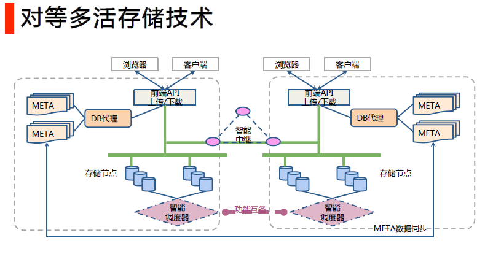

 
 
 
 
# 白山云存储服务(BaishanCloud storage service)
 
 
 
 
 BaishanCloud storage service Intro

 
**BaishanCloud Storage Service: It is a multi-data center, multi-copy, distributed architecture, object cloud storage service extended based on the advantages of BaishanCloud's powerful CDN-X service.**

## Functionality Overview：

1. High reliability and high performance: through multi-data center, multi-copy, distributed architecture, multi-device redundancy, cross-regional replication, off-site disaster recovery, internal intelligent scheduling of the system to ensure stable, durable and reliable for user data storage; through the CDN-X edge nodes for accelerated upload, through the whole network CDN for accelerated download. 

1. High security and protection: There are multiple security, reliability and user resource isolation mechanisms inside the system; precise data authority management, multi-level decentralization, multiple authentication and multiple authorization management mechanisms to prevent hotlinking and protect data security.

1. Flexible expansion, focus on service: unlimited expansion, no migration, to meet the growth trend of unstructured data, distributed and analytical functions; configuration of exclusive technical service interface people to understand user needs in depth, follow up user services.

1. Fully functional, easy to use: the core members of the R&D team have accumulated more than 7 years of experience in object cloud storage services, all independent intellectual property rights, self-developed core components, high concurrency production environment verification; user programming interface is simple, easy to use, stable and reliable
 
 

## Technical advantages：

1. Powerful CDN advantage: Accelerate uploading through BaishanCloud's CDN-X edge node, accelerate downloading through the whole BaishanCloud CDN network.

1. Follow compatible specifications: follow and compatible with Amazon S3 REST API interface, recommend users directly use the official SDK from Amazon S3, simple and easy to use, stable and reliable, users can use a variety of open-source tools, etc.

1. Audio and video transcoding and image processing: provide offline audio and video transcoding, and easy image processing interface (format conversion, rotation, scaling, cropping, compression, watermark, blur, and other filter operations), users can efficiently process static images online to avoid repeated upload/download images.

1. Powerful object cloud storage service architecture design: realize data temperature measurement, self-group edge storage, peer-to-peer multi-live, and self-activated quality control.

---

 
 
## 4 Technical innovations:
### 1. Data temperature measurement

1. Define data: Define data details in a total of six dimensions: data size, type, source, access frequency, and trustworthiness. Internal mechanism will schedule data grading based on access frequency. Hot data is automatically migrated and stored with high I/O.

1. Tiered data storage: After tiered hot and cold data, the hot data is provided with higher I/O by 3-copy strategy, while the cold data is provided with higher reliability. Through the data storage statistics, the data that carries 90% of the system's I/O is defined as hot data and the rest is defined as cold data, and the 3-copy of hot data is defined as cold data within the system periodically.

1. Asynchronous periodic merging: The hot/cold separation uses a hierarchical storage method, setting the newer data and the older data into different levels, and periodically merging the newer data from the upper level and the older data from the lower level into the lower level. This asynchronous periodic merging reduces the I/O updates consumption of cold data by 1 to 2 orders of magnitude.

###	2. Self-organized edge nodes 

1. Unified network planning: Through p2p broadcast network, our edge nodes are connected into one network to notify user’s file uploads to every server in the country within 1000ms, to achieve the ultimate consistency of user data with low latency. It allows all remote users to quickly access to the files uploaded.

1. Fiber optic link access: Edge nodes maintain communication with 5 central storage server rooms at the same time, and asynchronously transfer user uploaded files to the central storage within seconds through the data transfer acceleration network, ensuring the reliability of data up to 99.99999999999%.

1. Isolation of network failure: When the central storage fails or the edge storage nodes cannot communicate with the central storage, the edge nodes can also support users' upload and download requests within a certain period to isolate network failure to users.

### 3.Multi-layer high redundancy

1. High-quality multi-data center interconnection: multiple central storage fiber interconnection, synchronization of large files in seconds. Provide database offsite multiple writes and reads: completely circumvent the service availability problem caused by server room failure. By deploying multiple primary and backup copies in multiple server rooms, the database can be read and written simultaneously in multiple locations to complete off-site data backup function.

1. Cross-server synchronization in seconds: Ensure that when any server fails, it will not affect the service, truly achieving network-wide redundancy and disaster recovery across multiple server rooms.

1. Outage response in seconds: The failure discovery mechanism provides fast response speed in seconds. Automatically isolate unavailable database services, change read and write functions to available service nodes.

1. Database detection in seconds: Detect the database instance availability every second, and when it is not connected, immediately switch the database and update the configuration information. Each database agent monitors the configuration changes in real time and reloads and takes effect in 10 milliseconds when the configuration changes. To achieve high availability of data connections. 

1. Configuration decentralization: The backup configuration is deployed to multiple server rooms, so that when one server room fails, the system can still work normally for configuration changes and failure discovery.

### 4. Self-excitation quality control

1. paxos algorithm and automated data repair: paxos algorithm is used to automate the management of multiple copies, data self-repair, and consistency between multiple copies, etc. The entire storage system cluster is divided into 100,000 self-maintaining, self-repair groups, each group regularly detects the status of other nodes, data accuracy, and data repair at the granularity of minutes.

1. Improvements to paxos: First, the paxos algorithm guarantees the accuracy of automated data repair. paxos itself does not contain a description of the algorithm for paxos group management. Online environments using the paxos algorithm must also consider the handling of group member changes. The BaishanCloud Storage System introduces a self-designed and implemented paxos group management algorithm that enables group member changes through the operation of two phases of paxos instances. During the change process, the member change algorithm ensures data consistency, and the change result will not be affected by network or disk failure.

1. Ensure the security of operation process: Any network or disk failure during the process of member change will not cause the system error, and the service can continue to run after restart.

1. Comprehensive quality testing: 60 seconds to switch write points according to disk status; 5 minutes to check all copies status; 24 hours to complete copies data comparison and self-repair; 1 month for full data scanning and error correction.

## Scale and scalability of services:

|Service items|Scalable numbers|
|-------------|:-------------:|
|Number of users the service can carry|1 million users|
|Service data storage capacity|100+ PB level, 100+ billion files|
|Data write capacity (upload)| 500+ TB in 24 hours (currently 40TB)|
|Overall service throughput (download)|10+ PB 24-hour downloads (currently 1PB)|
|Number of physical servers|3000 (multiple data centers)|

## Service-Level Agreement (SLA).

 Reliability: 99.9999999999999%.

## Average upload/download speed by ISPs for Internet backbone nodes.

|Transfer file size|Upload speed|Download speed|
|-------------|:-------------:|-------------|
|50KB|300KB/s|900KB/s|
|2MB|750KB/s|2MB/s|
|4MB|1MB/s|2.5MB/s|

## Compliant and compatible with Amazon S3's interface, it is recommended that developers can directly use the official Amazon S3 SDK:

|Instruction documentation|SDK package download|
|-------------|:-------------:|
|Android documentation：[AWS Mobile SDK for Android Documentation][AWS Mobile SDK for Android Documentation]|SDK download:[aws-android-sdk][aws-android-sdk]|
|Browser documentation[Getting Started with the SDK in the Browser][Getting Started with the SDK in the Browser]| SDK download:[Bower][Bower]|
|IOS documentation：[AWS Mobile SDK iOS Developer Guid][AWS Mobile SDK iOS Developer Guid]    |SDK download: [aws-ios-sdk][aws-ios-sdk]|
|Java documentation：[AWS SDK for Java Developer Guide][AWS SDK for Java Developer Guide]|SDK download: [aws-java-sdk][aws-java-sdk]
|.NET documentation：[AWS SDK for .NET Documentation][AWS SDK for .NET Documentation]|SDK download: [AWSToolsAndSDKForNet.msi][AWSToolsAndSDKForNet.msi]|
|Node.js documentation：[AWS SDK for JavaScript Documentation][AWS SDK for JavaScript Documentation]|SDK download: [Getting Started with the SDK in Node.js]|
|PHP documentation：[AWS SDK for PHP Documentation][AWS SDK for PHP Documentation]|SDK download: [Installing via Composer][Installing via Composer]|
|Python documentation：[Boto 3 Documentation][Boto 3 Documentation]|SDK Download link and description:[Boto 3 - The AWS SDK for Python][Boto 3 - The AWS SDK for Python]|
|Ruby documentation：[AWS SDK for Ruby][AWS SDK for Ruby]|SDK download：[AWS SDK for Ruby Developer Guide v2.16.8][AWS SDK for Ruby Developer Guide v2.16.8]|
|Go documentation：[AWS SDK for Go][AWS SDK for Go]|SDK download：[aws-sdk-go][aws-sdk-go]|
|C++ documentation：[AWS SDK for C++ Documentation][AWS SDK for C++ Documentation]|SDK download：[aws-sdk-cpp][aws-sdk-cpp]|

[AWS SDK for Java Developer Guide]:http://docs.aws.amazon.com/sdk-for-java/v1/developer-guide/aws-sdk-java-dg.pdf
[aws-java-sdk]:https://sdk-for-java.amazonwebservices.com/latest/aws-java-sdk.zip

[Boto 3 - The AWS SDK for Python]:https://github.com/boto/boto3#quick-start
[Boto 3 Documentation]:http://boto3.readthedocs.io/en/latest/index.html

[Getting Started with the SDK in the Browser]:http://docs.aws.amazon.com/AWSJavaScriptSDK/guide/browser-intro.html

[Bower]:https://bower.io/

[AWS Mobile SDK iOS Developer Guid]:http://docs.aws.amazon.com/mobile/sdkforios/developerguide/aws-ios-dg.pdf
[aws-ios-sdk]:https://sdk-for-ios.amazonwebservices.com/latest/aws-ios-sdk.zip

[AWS Mobile SDK for Android Documentation]:https://aws.amazon.com/cn/documentation/sdk-for-android/
[aws-android-sdk]:https://sdk-for-android.amazonwebservices.com/latest/aws-android-sdk.zip

[AWSToolsAndSDKForNet.msi]:https://sdk-for-net.amazonwebservices.com/latest/AWSToolsAndSDKForNet.msi
[AWS SDK for .NET Documentation]:https://aws.amazon.com/cn/documentation/sdk-for-net/

[AWS SDK for JavaScript Documentation]:https://aws.amazon.com/cn/documentation/sdk-for-javascript/
[Getting Started with the SDK in Node.js]:http://docs.aws.amazon.com/AWSJavaScriptSDK/guide/node-intro.html

[AWS SDK for PHP Documentation]:https://aws.amazon.com/cn/documentation/sdk-for-php/
[Installing via Composer]:http://docs.aws.amazon.com/aws-sdk-php/v3/guide/getting-started/installation.html

[AWS SDK for Ruby]:https://aws.amazon.com/cn/documentation/sdk-for-ruby/
[AWS SDK for Ruby Developer Guide v2.16.8]:http://docs.aws.amazon.com/sdk-for-ruby/v2/developer-guide/

[AWS SDK for Go]:http://docs.aws.amazon.com/sdk-for-go/api/
[aws-sdk-go]:https://github.com/aws/aws-sdk-go/wiki

[AWS SDK for C++ Documentation]:https://aws.amazon.com/cn/documentation/sdk-for-cpp/
[aws-sdk-cpp]:https://github.com/aws/aws-sdk-cpp

---
 
 
 
 Advanced technology explanation 
---
## 1. BaishanCloud Storage Service & BaishanCloud CDN-X
### CDN-X acceleration supports:

- CDN upload acceleration

- CDN virtual domain name back to the origin

- CDN token to protect users' data security.

- Third-party CDN back to origin

### CDN Edge nodes upload:

BaishanCloud Storage enhances the speed of uploads by working with CDN edge nodes.  

Users request an accelerated upload of their domain name, and the DNS server intelligently returns the IP of the nearest CDN edge node to the user.  

Users upload files to the nearest edge node, and the edge node transfers data to the storage center through the optimal routing.  

By comparing the speed of uploading by edge nodes with directly uploading to the storage center, the average speed is more than doubled, which greatly improves the upload experience.  

Configure to use accelerated upload domain to accelerate upload function.  

### Configuration methods for CDN-X and cloud storage:

To test the download acceleration through CDN, you need to point your domain to the CNAME that CDN provides.

For example CNAME: www.qq.com.i.qingcdn.com, origin is ss.bscstorage.com.

Suggestions for creating a bucket:

1. Create a bucket with the same name as the user's domain name. e.g. if the user's website domain name is www.baishancloud.com, then create a bucket with the name of www.baishancloud.com, then there is no need to modify the host header when the CDN is configured.

1. Create a bucket with user-defined name: for example, the user website domain name is www.baishancloud.com, the user wants to create a bucket named QQ, then on CDN acceleration acceleration, when user requests www.baishancloud.com.s2.i.baishancloud.com, you need to change the host header to qq.ss.bscstorage.com.

### 404 status and how to pull the file from origin:

If the file does not exist on BaishanCloud Storage, you can configure to go to one specific domain to pull the content.

The file pull is asynchronous, and the completion time is related to the size of the file.

The request also returns a 302, and the value of the location response header is the domain where the file to be pulled.

When using the pull function, you need to provide：

- The domain we use to go back to origin.

- The mapping rule from request uri to origin file uri.

- The token verification method on back to origin request (optional).

- Whether to enable the HEAD request to pull the file from origin.

### How to set the caching policy for origin storage:

- BaiShanCloud Storage can configure HTTP request headers such as Cache-Control of the stored files and deploy the caching policy together with HTTP access requests.
- BaishanCloud CDN can enforce the caching policy according to origin on the Cache-Control setting in the HTTP request header.
  
 
 
  
## 2. Concept of object storage, directory structure, permission setting, transfer import

### Concept of Bucket and Object
 
- Bucket is the basic container that holds the data. Everything that you store in Cloud Storage such as objects must be contained in a bucket.
 
- Each piece of data is an object, for instance we can treat each file as an object.
 
- Users can create buckets, delete buckets, query objects in buckets, and set bucket properties.
 
- The user can create an object (this object is the file uploaded by the user), delete an object, download the object, set the access rights of the object, etc.
 
- For example: 1. Create a bucket, the bucket name is: baishan_yun, and the requested url is: PUT /baishan_yun.

### Directory structure of object storage: 
The object stored in BaishanCloud is not a file in the traditional sense, as well as the storage method of how file stored in the file system. Each Object looks like a file under a directory, but is just a directory-like string for cloud storage. This doesn't affect how the user list files from the specified directory:
 
 
When sending a request to list files, set the prefix parameter to the name of the directory prefix, you can only list the files in this directory, for example: 
- bucket/1.mp4
- bucket/cc/2.mp4
- bucket/cc/3 .mp4
- bucket/dd/ee/ff/3.mp4 

When the requested `prefix` is specified as `cc`, it will list:
- 2.mp4
- 3.mp4

This process is as same as listing files from a directory. In addition to simulating directory listing files, 
it also provides functions such as specifying the maximum number of files to list, 
specifying to list files after a certain file name (sorted in alphabetical order), and merging files according to common prefixes.
For details, please refer to the API documentation. 

Things to pay attention to when using:
 
- Object name should not start with '/'.
  
  For example: You need to upload a file called file.txt, bucket is `sandbox`.
    
    - Object is set to `file.txt`, when accessing it should be `http://ss. bscstorage.com/sandbox/file.txt` (recommended)
    - If object is set to `/file.txt`, it should be `http://ss.bscstorage.com/sandbox//file.txt` when accessing (strongly not recommended)

- It is best not to have two consecutive '/' in the object name. For example: You need to upload a file called file.txt in the folder directory, and the bucket is `sandbox`,
 
    - Object is set to `folder/file.txt`, when accessing it should be `http://ss.bscstorage.com/sandbox/folder/file.txt` (recommended method)
 
    - If object is set to `folder//file.txt`, it should be `http://ss.bscstorage.com/sandbox/folder//file.txt` when accessing (strongly not recommended)
 
    - Why does BaishanCloud Storage not recommend two '//' in the URL: some CDN cache servers may combine two consecutive '//' in the URL into one '/' round-trip source, in this case, the Authentication failed or 404
    
### 如何删除白山云存储中的目录：

白山云存储删除目录的方法为：
白山云存储不支持直接删除一个目录,
因为 Amazon S3 API 没有严格意义上的目录的概念(没有目录层级的结构,但习惯上把 Object 按照"/"分隔当做目录来使用),这种情况下,对多个文件操作的原子性方面没法保证，所以这方面都是写脚本实现的。

可以通过以下方式完成该操作：

- 通过List Objects接口列出该目录的所有文件。
- 通过Delete Object接口逐一进行删除。
- 删除目录。

请注意：

- List Objects接口返回的文件列表不全部是该目录下的文件（列表是根据文件名字符排序的），
  可能包含下一个或几个目录；所以需要根据实际情况调整max-keys参数的值，
  并且需要对每一个文件进行筛选，确认是该目录的文件;
  如果设置 `prefix` 参数的话，就可以严格的列出以该 `prefix` 下所有文件.

- 一次删除（列出所有文件，逐一删除）不能保障该目录的文件都被清理完成
  在删除的过程中可能会有新上传，所以整个过程不能保持原子性。

### Access control permission details:

the authorized person can be a user, a group, or all users.

1. Control permission for the Bucket:

    Read: allow the authorized person to list all objects in the bucket. 
    Writable: Allows the grantee to create, overwrite, and delete objects in the bucket. 
    Readable ACL: Allows the grantee to read the bucket's ACL. 
    Writable ACL: Allows the grantee to modify the bucket's ACL. 
    All permissions: Allows the authorized person to read, write, read ACL, and write ACL on the bucket.
    

2. Control permission for Object: 

    Readable: Allows the authorized person to read the data and meta information of the object. 
    Readable ACL: Allows the grantee to read the ACL of the object. 
    Writable ACL: Allows the grantee to modify the object's ACL. 
    Full Permissions: Allows the authorized person to read, read ACL, and write ACL on the object. 

### How to operate buckets and objects without signatures: 

Normal operations require signatures to verify user permissions, but it is also allowed to set common attributes to allow users to operate without signatures.
 
- After the bucket permission is set to public-read, any user can list the files under the bucket, and the request does not require a signature.
 
- After the bucket permission is set to public-read-write, any user can list the files in the bucket and upload files to the bucket. The request does not require a signature.
 
- When uploading a file, after specifying the object's permission as public-read, any user can download the file without a signature, it is called anonymous download.
 
- When a user accesses the storage through the CDN back-to-source, because the CDN is configured with super permissions, the request does not require a signature to access the files on the storage.

### 4 ways to import data:
 
1. The user uses the SDK upload file interface to upload the file to the storage.
 
2. The user uses the SDK to generate the offline download task, and the offline download subsystem of the storage is responsible for downloading the data from the origin site and synchronizing it to the storage.
 
3. The user configures the 404 back-to-origin rule. When the end-user accesses the bucket, it will automatically go back to the origin site to capture the data and synchronize it to the storage.
 
4. The user provides the file download list, and BaishanCloud Storage platform downloads and synchronizes the data to storage through the file list.

### HTTPS setting up:
1. Before setting up the HTTPS for a domain, the domain must acquire an ICP license. And users can submit the SSL certificate of the domain name to BaishanCloud console, after the uploading is completed and the SSL certificate is associated with the domain, the HTTPS is enabled for the domain.
 
1. If you use the domain name provided by BaishanCloud Storage, for example: https://ss.bscstorage.com, note: the bucket must be placed in the url request instead of the domain name.
 
### Support for FTP and rsync upload: 

BaishanCloud storage service does not directly support the FTP and rsync protocols because of the control of file permissions of the interface.  
 
But users can use the following tools to achieve FTP, rsync upload.  
 
- A graphical FTP alternative can use [cyberduck][cyberduck] for Mac or [s3browser][s3browser] for Windows.
 
- An alternative to command line FTP or rsync can use [s3cmd][s3cmd]. [s3cmd]: http://s3tools.org/s3cmd[boto]: http://boto.cloudhackers.com/en/latest/[cyberduck]: https://cyberduck.io/[s3browser]: http:/ /s3browser.com

### 3 steps for large file upload:
1. First call the range upload initialization interface, and the request returns an ‘uploadId’. The next 2 steps require this ‘uploadId’ to identify each range file to be uploaded.
 
2. Divide the large file into several pieces, call the piece upload interface, upload each piece, and identify the order of the pieces through the ‘partNmuber’ parameter in the request.
 
3. After the upload is complete, call the range completion interface to notify the storage that the large file upload is complete. 
   
The total data capacity and number of data objects stored in BaishanCloud are not limited. Individual data objects can be between 1 byte and 1 TB in size. The maximum data object that can be uploaded in a single PUT is 1TB. It is recommended to use the range upload interface to upload large files. The specifications for range upload are:
 
- The maximum size of each slice is 512MB.
 
- The maximum number of slice is 2000.
 
- The maximum size of a single file is 1TB.

### How to use offline download to synchronize data:

The offline download service supports HTTP protocol, BT protocol, magnet link, etc.  
 
By submitting an offline download task, the offline download service will download the file from the website according to the file address provided in the task and synchronize it to the storage. After the synchronization is completed, the operation result is sent to the user.  
 
Supports various functions such as download task status query, task cancellation, download data corruption check, and fast message transmission within seconds, the performance can reach up to 2000 rps/s .  

How to use: 
 
- Using the SDK, send a request to offline.bscstorage.com. The requested url is: http://offline_domain/<bucket>, fill in the desired bucket name in the <bucket> section.
 
- Send the request body as an offline task, for example:

		{   "Url":"http://www.abc.com/download/movie.mp4",
			"Key":"movies/2016/movie.mp4",
			"SHA1":"abcdeabcdeabcdeabcdeabcdeabcdeabcdeabcde",
			"MD5":"abcdabcdabcdabcdabcdabcdabcdabcd",
			"CRC32":"abcdef",
			"SuccessCallbackUrl":"http://website/succ/",
			"FailureCallbackUrl":"http://website/fail/",
		}

- The user needs to start a service to receive the offline download results sent by the offline download service.   

## 3. Audio and video transcoding, static image processing, self-service management console 
### Audio and video transcoding: support transcoding between formats such as flv, mp4, mov, etc. 
Support reducing bit rate, resolution, modifying gop (key frame interval), video screenshots and other functions.

### BaishanCloud cloud storage static file processing:
- Supports format conversion, rotation, scaling, cropping, image-text mixing, watermarking and custom image processing of static images, see imgx_manual documentation for details.
- After the requested image is processed and cached, the next request will not enable the processing procedure repeatedly. The default coaching time is 7 days.
- If a CDN service is configured and enabled, the processed images will be automatically pushed to the CDN edge nodes.
- If the original image is modified, you can use the v command to regenerate the image and link.

### Account and testing environment creation:
 Please provide enterprise information and contact information for each account, the account team will manually audit the provided information.
- BaishanCloud console creates a user, generates the accseskey and secretkey corresponding to the user, and creates a bucket corresponding to the user.
- Users can also enable service by using the accseskey and secretkey, and encode according to the instruction given in the SDK demo to proceed. Users can submit more requirements such as:
- upload file type, picture video text. 
- Average file size range. 
- Approximate storage space requirements. 
- Whether you need to use CDN. - Whether upload acceleration is required.

### Users can view the following information in real-time through the self-service management console

- User space information, including usage, number of files used.
- Historical logs such as bandwidth, traffic, and number of requests used by users.
- Users can view file size distribution, file type distribution, etc.
- Provide billing information, including billing details for used traffic, space, and number of requests.
- BaishanCloud storage service user manual, audio and video conversion, image processing and other documents.
- Key management, password management.

