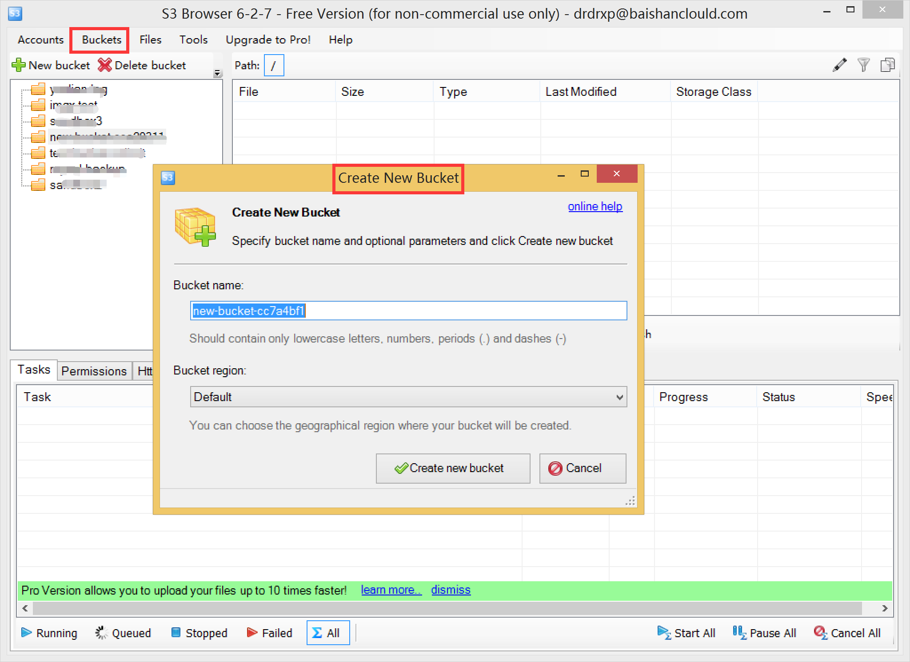

# Steps of using S3 browser to connect Baishan storage and upload files under Windows

## Step 1

Open S3 browser software, and the interface is shown in the following figure:

## Step 2

Click add new account under accounts to open the following interface. Note that select S3 compatible storage for storage type and SS for rest endpoint bscstorage. com。 Enter the account, accessKey and secret key, and then click to add a new account.

## Step 3

After adding a new account, you can see the contents of storage. Select a bucket on the left and click upload to upload files to the bucket.

## Step 4

Select a bucket on the left and click new folder to create a new folder in this bucket.

## Step 5

Select a file and click download and delete to download and delete the file.

## Step 6

You can also click the buckets menu to add a bucket and other operations. So far, you have learned all the processes of docking Baishan storage and uploading files with S3 browser.

S3 browser download address:[s3-browser](http://s3browser.com/)

s3-browser