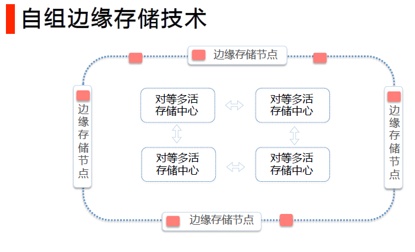
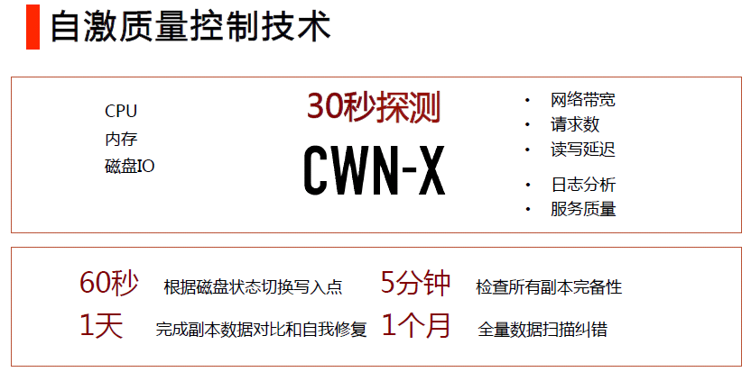

 
 
 
 
# 白山云存储服务(BaishanCloud storage service)
 
 
 
 
白山云存储服务介绍

 
**白山云存储服务：是以白山云强大的CDN-X服务优势为基础，延展出的多数据中心、多副本、分布式架构、对象云存储服务。**

### 功能性概述：

1. 高可靠、高性能：通过多数据中心、多副本、分布式架构、多设备冗余、跨区域复制、异地容灾、系统内部智能调度保障用户数据稳定存储、持久可靠；通过CDN-X边缘节点进行加速上传、通过全网CDN进行加速下载。

1. 高安全、高防护：系统内部有多重安全性、可靠性、用户资源隔离等机制；精确的数据权限管理、多级分权、多种鉴权、多种授权管理机制，防止盗链、保护数据安全。

1. 弹性扩容、注重服务：无限制扩容、无需迁移、满足非结构化数据增长趋势、分布式和分析功能；配置专属技术服务接口人深入了解用户需求、跟进用户服务。

1. 功能齐备、简单易用：研发团队核心成员7年以上对象云存储服务经验积累，全自主知识产权，自研核心组件，高并发生产环境验证；用户编程接口简洁易用、稳定可靠
 
 

### 技术优势：

1. 强大的CDN优势：通过白山云自主的CDN-X边缘节点进行加速上传、通过全网CDN进行加速下载。

1. 遵循和兼容规范：遵循和兼容Amazon S3 REST API接口，推荐开发人员直接使用Amazon S3的官方SDK，简洁易用、稳定可靠, 用户可以使用各种开源客户端、工具等。

1. 音视频转码和图片处理：提供离线音视频转码功能，丰富、便捷的图片处理接口（格式转换、旋转、缩放、剪裁、压缩、水印、模糊等滤镜操作），用户可以高效在线处理静态图片，避免图片重复上传/下载。

1. 强大的对象云存储服务架构设计：实现数据温度测量、自组边缘存储、对等多活、自激质量控制。

---

 
 
### 4项技术创新：
####	1.数据温度测量：

1. 定义数据温度：从数据大小、类型、来源、访问频次、一度关系、可信度共六个维度，来定义数据的热度。内部机制调度数据冷热分级。热数据用高IO存储，热数据自动迁移。

1. 数据分层存储：分层冷热数据后, 对热数据用3副本策略提供更高 IO, 对冷数据则提供更高可靠性。通过存储端的数据统计, 将承载系统90%的IO的数据定义为热数据,其他定义为冷数据, 并在系统内部定期将3副本保存的热数据,转定义成为冷数据。

1. 异步定期合并：冷热分离中使用分层的存储方式, 将较新的数据和较老的数据设定为不同的层次, 定期将上层的新数据和下层的老数据合并成到下层数据的层次中, 这种异步 定期合并的方式, 将冷数据的更新的IO消耗降低了1到2个数量级。

####	2.自组边缘节点

1. 统一规划网络：通过p2p 的广播网络, 将128个边缘节点连接成一个网络, 在1000ms 以内将用户上传文件的消息通知到全国的每个机房, 以此达到用户数据低延迟的最终一致性。让用户能快速读取到远距离用户上传的文件。

1. 内容就近写入：自组边缘节点部署在全国128个距离用户最近的机房中, 当用户上传或下载文件时, 自动将用户定位到距离最近的机房, 实现用户的告诉上传和下载。

1. 光纤链路接入：边缘节点同时与5个中心核心存储机房保持通信, 通过数据传输加速网络, 在几秒钟的时间内, 异步将用户上传的文件传输到中心存储, 保证数据最终的可靠性达到13个9。

1. 隔离网络故障：同时, 当中心存储出现故障或者边缘存储节点无法与中心存储通信时, 边缘节点也可以在一定时间内支持用户的上传和下载请求, 以达到对用户隔离网络故障的效果。

####	3.对等多活

1. 高质量多数据中心互联：多中心存储光纤互联，大文件秒级同步。实现数据库异地多写多读：完全规避了机房故障造成的服务可用性问题。通过数据库在多个机房内部署多主复制, 实现多地的同时读取和写入, 完成异地数据备份功能。

1. 秒级跨机房同步：保证任意一个机房出现故障的时候,都不会影响业务写入和读取,真正做到全网跨多机房冗余和灾备。

1. 秒级反应故障：故障发现机制提供了秒级的故障反应速度。自动隔离不可用的数据库服务, 变更读写到可用服务节点。

1. 秒级数据库探测：每秒定时连接数据库实例, 探测是否可用, 当连接不可用时, 立即向跨机房的配置中心服务发送切换数据库的指令,更新配置信息。每个数据库代理实时监视配置中心的配置变化, 当配置发生变化时, 在10毫秒级别实现配置重新加载和生效. 达到高可用的数据连接。

1. 将配置去中心化：将备份的配置中心服务部署到多个机房, 使得任何一个机房出现故障时,系统仍可以正常工作, 进行正常的配置变化,故障发现。

####	4.自激质量控制

1. paxos算法与自动化数据修复：通过paxos算法,用于实现多副本的自动管理, 数据自我修复, 多副本之间保持一致性等。将整个存储系统的集群划分成10万个自我维护、自我修复的组,每个组内定时探测其他节点的存活状态, 数据正确性, 以及以分钟为粒度来进行数据的修复。

1. 对paxos的改进:首先paxos算法保证了自动化数据修复的正确性。paxos本身没有包含对paxos组管理的算法描述。线上环境使用paxos算法时必须考虑到组成员变化的处理。白山云存储系统引入了自行设计和实现的paxos组管理算法,通过2个阶段的paxos实例的运行, 可以实现组成员的变更。在变更过程中我们的成员变更算法保证数据一致性，变更结果不会因为网络,磁盘故障而影响最终结果。

1. 保证运行过程的安全性: 成员变更的过程中任何网络或磁盘故障不会造成系统处于不完整的状态, 服务重启之后仍可以继续运行。

1. 全面质量检测：60秒根据磁盘状态切换写入点；5分钟检查所有副本完备性；24小时完成副本数据对比和自我修复；1个月全量数据扫描纠错。

## 服务的规模和可扩展性：

|可扩展服务项|可扩展至数量级|
|-------------|:-------------:|
|服务可承载用户数量|100万用户|
|服务数据存储量|100PB级，千亿文件|
|数据写入能力(上传)|24小时上传超过500TB（目前为40TB）|
|服务整体吞吐量(下载)|24小时下载10PB(目前为1PB)|
|物理服务器数量|3000（多数据中心）|

## 服务等级协议（Service-Level Agreement，SLA）：

1. 可靠性：（对象存储服务的持久性）为99.99999999999%（13个9）。

## 互联网主干节点各运营商平均上传/下载速度：

|传输文件大小|上传速度|下载速度|
|-------------|:-------------:|-------------|
|50KB|300KB/秒|900KB/秒|
|2MB|750KB/秒|2MB/秒|
|4MB|1MB/秒|2.5MB/秒|

## 遵循和兼容Amazon S3的接口，推荐开发人员可直接使用Amazon S3的官方SDK：

|说明文档|SDK包下载|
|-------------|:-------------:|
|Android文档：[AWS Mobile SDK for Android Documentation][AWS Mobile SDK for Android Documentation]|SDK下载:[aws-android-sdk][aws-android-sdk]|
|Browser文档：[Getting Started with the SDK in the Browser][Getting Started with the SDK in the Browser]|SDK下载：[Bower][Bower]|
|ISO文档：[AWS Mobile SDK iOS Developer Guid][AWS Mobile SDK iOS Developer Guid]    |SDK下载:[aws-ios-sdk][aws-ios-sdk]|
|Java文档：[AWS SDK for Java Developer Guide][AWS SDK for Java Developer Guide]|SDK下载：[aws-java-sdk][aws-java-sdk]
|.NET文档：[AWS SDK for .NET Documentation][AWS SDK for .NET Documentation]|SDK下载:[AWSToolsAndSDKForNet.msi][AWSToolsAndSDKForNet.msi]|
|Node.js文档：[AWS SDK for JavaScript Documentation][AWS SDK for JavaScript Documentation]|SDK下载:[Getting Started with the SDK in Node.js]|
|PHP文档：[AWS SDK for PHP Documentation][AWS SDK for PHP Documentation]|SDK下载:[Installing via Composer][Installing via Composer]|
|Python文档：[Boto 3 Documentation][Boto 3 Documentation]|SDK下载地址及说明：[Boto 3 - The AWS SDK for Python][Boto 3 - The AWS SDK for Python]|
|Ruby文档：[AWS SDK for Ruby][AWS SDK for Ruby]|SDK下载地址：[AWS SDK for Ruby Developer Guide v2.16.8][AWS SDK for Ruby Developer Guide v2.16.8]|
|Go文档：[AWS SDK for Go][AWS SDK for Go]|SDK下载地址：[aws-sdk-go][aws-sdk-go]|
|C++文档：[AWS SDK for C++ Documentation][AWS SDK for C++ Documentation]|SDK下载地址：[aws-sdk-cpp][aws-sdk-cpp]|

[AWS SDK for Java Developer Guide]:http://docs.aws.amazon.com/sdk-for-java/v1/developer-guide/aws-sdk-java-dg.pdf
[aws-java-sdk]:https://sdk-for-java.amazonwebservices.com/latest/aws-java-sdk.zip

[Boto 3 - The AWS SDK for Python]:https://github.com/boto/boto3#quick-start
[Boto 3 Documentation]:http://boto3.readthedocs.io/en/latest/index.html

[Getting Started with the SDK in the Browser]:http://docs.aws.amazon.com/AWSJavaScriptSDK/guide/browser-intro.html
[Bower]:https://bower.io/

[AWS Mobile SDK iOS Developer Guid]:http://docs.aws.amazon.com/mobile/sdkforios/developerguide/aws-ios-dg.pdf
[aws-ios-sdk]:https://sdk-for-ios.amazonwebservices.com/latest/aws-ios-sdk.zip

[AWS Mobile SDK for Android Documentation]:https://aws.amazon.com/cn/documentation/sdk-for-android/
[aws-android-sdk]:https://sdk-for-android.amazonwebservices.com/latest/aws-android-sdk.zip

[AWSToolsAndSDKForNet.msi]:https://sdk-for-net.amazonwebservices.com/latest/AWSToolsAndSDKForNet.msi
[AWS SDK for .NET Documentation]:https://aws.amazon.com/cn/documentation/sdk-for-net/

[AWS SDK for JavaScript Documentation]:https://aws.amazon.com/cn/documentation/sdk-for-javascript/
[Getting Started with the SDK in Node.js]:http://docs.aws.amazon.com/AWSJavaScriptSDK/guide/node-intro.html

[AWS SDK for PHP Documentation]:https://aws.amazon.com/cn/documentation/sdk-for-php/
[Installing via Composer]:http://docs.aws.amazon.com/aws-sdk-php/v3/guide/getting-started/installation.html

[AWS SDK for Ruby]:https://aws.amazon.com/cn/documentation/sdk-for-ruby/
[AWS SDK for Ruby Developer Guide v2.16.8]:http://docs.aws.amazon.com/sdk-for-ruby/v2/developer-guide/

[AWS SDK for Go]:http://docs.aws.amazon.com/sdk-for-go/api/
[aws-sdk-go]:https://github.com/aws/aws-sdk-go/wiki

[AWS SDK for C++ Documentation]:https://aws.amazon.com/cn/documentation/sdk-for-cpp/
[aws-sdk-cpp]:https://github.com/aws/aws-sdk-cpp

---
 
 
 
进阶技术讲解
---
## 1.白山云存储服务 & 白山云CDN-X
### CDN-X加速支持：

- CDN上传加速。
- CDN虚拟域名回源。
- CDN签名回源，保护用户的数据安全。
- 第三方CDN回源。

### CDN边缘节点上传:

白山云存储通过和CDN的边缘节点配合使用，提升上传的速度。 
用户请求加速上传域名，由DNS服务器智能将距离用户最近的CDN边缘节点的ip返给用户。 
用户将文件上传到最近的边缘节点，边缘节点通过最优路径，将数据传输到存储中心。 

通过边缘节点加速上传和直接上传到存储中心的对比，平均速度提升一倍多，极大地改善了上传的体验。 
配置使用加速上传域名即可上传加速功能。 

### CDN-X和云存储的配置方法：

如果要测试通过CDN进行下载加速的情况，需要将用户要访问的已备案的域名CNAME到CDN给出的域名。
例如www.qq.com.i.qingcdn.com，CDN回源至s2.i.qingcdn.com。

创建bucket的建议：

1. 以用户域名创建同名的bucket。例如用户网站域名www.baishancloud.com，那么创建www.baishancloud.com这样一个bucket，这时CDN配置加速时，无需修改host。

1. 用户自定义bucket的名称：例如用户网站域名www.baishancloud.com，用户要创建一个qq的bucket，那么CDN在配置加速时，用户访问www.baishancloud.com.s2.i.baishancloud.com，回源时，需要将host修改成qq.s2.i.qingcdn.com。

### 404回源的方法及如何拉取文件：

如果白山云存储上不存在该文件，可以配置指定去某个域名拉取文件。
-文件的拉取是异步的，拉取完成时间和拉取的文件大小相关。
同时该请求会返回302，location响应头的值是文件拉取的地址。

使用拉取功能时，需要提供：

- 回源的域名domain。
- 请求uri到回源拉取文件uri的映射规则。
- 回源请求的校验方式（可选）。
- 是否启用HEAD请求回源拉取文件。

### 源存储如何设置缓存时间:
- 白山云存储可以设置所存储文件的Cache-Control等HTTP请求头的设置，并将缓存设置与HTTP访问请求一起下发。
- 白山云CDN可以按源站返回HTTP请求头里的Cache-Control设置执行缓存策略。

 
 
## 2.对象存储的对象概念、目录结构、权限设置、传输导入
### Bucket和Object的概念

- Bucket是桶的意思，这个桶里面就可以存放很多文件。
- Object是对象的意思，我们可以把每个文件都作为一个对象。
- 用户可以创建桶、删除桶、查询桶里面的对象、可以设置桶的属性等。
- 用户可以创建一个对象（这个对象就是用户上传的文件）、删除对象、下载对象、设置对象的访问权限等。
- 小例子：

1. 创建一个桶,桶名叫: baishan_yun，请求的url：PUT /baishan_yun。
1. 上传文件到baishan_yun的桶里，对象名叫: hello_world，每个文件通过桶名和对象名来唯一标识，请求的url：PUT /baishan_yun/hello_world。
1. 要下载这个文件，请求的url：GET /baishan_yun/hello_world
1. 删除这个文件，请求的url：DELETE /baishan_yun/hello_world
1. 删除桶，请求的url：DELETE /baishan_yun

### 对象存储的目录结构:

白山云存储的Object不是传统意义上的一个文件，存储方式也不是以文件系统保存的。
每个Object看上去是一个目录下的文件，但对于云存储只是一个类似目录的字符串。
但是这并不影响用户想从指定目录列文件的方式： 
当发送列文件的请求时，设置prefix参数为目录前缀的名字，则可以只列出这个目录下的文件，比如：

- bucket/1.mp4
- bucket/cc/2.mp4
- bucket/cc/3.mp4
- bucket/dd/ee/ff/3.mp4

当请求的`prefix`指定为`cc`时，将会列出：

- 2.mp4
- 3.mp4

跟从目录列文件的体验是一样的。
除了模拟目录列文件，还提供指定列出最大的文件数目、指定从某个文件名之后列出文件(按照字母顺序进行排序)、将文件按公共前缀进行合并等功能，详细可参照API文档。

使用的时候需要注意的问题：

- Object 名字最好不要用 '/' 开头
  比如： 需要上传一个叫file.txt文件，bucket 是 `sandbox`,

  - object 设置为 `file.txt`, 访问的时候应该是 `http://s2.i.qingcdn.com/sandbox/file.txt` （推荐方式）
  - object 如果设置为 `/file.txt`, 访问的时候应该是 `http://s2.i.qingcdn.com/sandbox//file.txt` （强烈不推荐）

- Object 名字中最好不要有两个连续的 '/'
  比如： 需要在folder目录下上传一个叫file.txt文件，bucket 是 `sandbox`,

  - object 设置为 `folder/file.txt`, 访问的时候应该是 `http://s2.i.qingcdn.com/sandbox/folder/file.txt` （推荐方式）
  - object 如果设置为 `folder//file.txt`, 访问的时候应该是 `http://s2.i.qingcdn.com/sandbox/folder//file.txt` （强烈不推荐）
  - 为什么白山云存储不建议在URL中带有2个'//'：某些CDN的cache server可能会把URL中两个连续的'//'合并为一个'/'来回源，这个时候就会出现验证失败或者404

### 如何删除白山云存储中的目录：

白山云存储删除目录的方法为：
白山云存储不支持直接删除一个目录,
因为 Amazon S3 API 没有严格意义上的目录的概念(没有目录层级的结构,但习惯上把 Object 按照"/"分隔当做目录来使用),这种情况下,对多个文件操作的原子性方面没法保证，所以这方面都是写脚本实现的。

可以通过以下方式完成该操作：

- 通过List Objects接口列出该目录的所有文件。
- 通过Delete Object接口逐一进行删除。
- 删除目录。

请注意：

- List Objects接口返回的文件列表不全部是该目录下的文件（列表是根据文件名字符排序的），
  可能包含下一个或几个目录；所以需要根据实际情况调整max-keys参数的值，
  并且需要对每一个文件进行筛选，确认是该目录的文件;
  如果设置 `prefix` 参数的话，就可以严格的列出以该 `prefix` 下所有文件.

- 一次删除（列出所有文件，逐一删除）不能保障该目录的文件都被清理完成
  在删除的过程中可能会有新上传，所以整个过程不能保持原子性。

### 访问控制权限详解：

被授权者可以是某个用户、某个组、所有用户

1.对于Bucket的控制权限：

	可读：允许被授权者列出bucket中所有的对象。
	可写：允许被授权者创建、覆盖和删除存储桶中的对象。
	可读ACL：允许被授权者读取存储桶的ACL。
	可写ACL：允许被授权者修改存储桶的ACL。
	全部权限：允许被授权者对存储桶的可读、可写、可读ACL、可写ACL。

2.对于Object的控制权限：

	可读：允许被授权者读取对象的数据和meta信息。
	可读ACL：允许被授权者读取对象的ACL。
	可写ACL：允许被授权者修改对象的ACL。
	全部权限：允许被授权者在对象上的可读、可读ACL、可写ACL。

### 如何使用不用签名操作操作bucket和object：

正常的操作都需要签名进行用户权限的验证，但是也允许设置共有属性，让用户不用签名来操作。

- 将bucket权限设置成public-read之后，任何用户都可以列出这个bucket下的文件，请求不需要签名。
- 将bucket权限设置成public-read-write之后，任何用户都可以列出这个bucket下的文件，并且可以上传文件到该bucket下，请求不需要签名。
- 当上传文件时，指定Object的权限是public-read之后，任何用户都可以下载该文件，不需要签名，即所谓的匿名下载。
- 当用户通过CDN回源来访问存储时，因为给CDN配置了超级权限，所以请求不需要签名也可以访问存储上的文件。

### 4种数据导入方式:

1. 用户使用SDK上传文件接口，将文件上传到存储上。
1. 用户使用SDK生成离线下载任务，由存储的离线下载子系统负责将数据从源站进行下载，同步到存储上。
1. 用户配置404回源的规则，当用户访问该用户的bucket，会自动去源站将数据抓取下来，同步到存储上。
1. 用户提供文件的下载列表，白山云存储通过文件列表，将数据下载并同步到存储上。

### https设置方法：

1. 如果使用用户域名，首先用户域名需要备案，用户将申请域名的SSL证书提交白山云，白山云将SSL证书加入用户配置，即可使用。
1. 如果使用白山云存储提供的域名，例如： https://ss.bscstorage.com，注：必须将bucket放在url请求中，而不是放在域名中。

### 对ftp、rsync上传的支持：

白山云存储服务基于文件权限的控制和接口简洁可靠的原因，不直接支持ftp和rsync协议。 
但用户可以使用如下工具，实现ftp、rsync上传。 

- 形界面的ftp替代品可以使用Mac下的[cyberduck][cyberduck]或Windows下的[s3browser][s3browser]。
- 命令行方式的ftp或rsync的替代品可以使用[s3cmd][s3cmd]。

[s3cmd]:        http://s3tools.org/s3cmd
[boto]:         http://boto.cloudhackers.com/en/latest/
[cyberduck]:    https://cyberduck.io/
[s3browser]:    http://s3browser.com

### 大文件上传的3个步骤：
1. 首先调用分片上传初始化接口，请求返回一个uploadId, 后续2步需要这个uploadId标识每个分片上传。
1. 将大文件分成若干片，调用分片上传接口，上传每个分片, 请求中通过partNmuber参数标识这个块的顺序。
1. 上传完成后，调用分片完成接口，通知存储，文件分片上传完成。

白山云存储的总数据容量和数据对象数量不受限制。各个数据对象的大小可在1字节至1TB之间。
可在单个PUT中上传的最大数据对象为10GB。

建议使用分片上传接口进行大文件上传，分片上传的规范是：

1. 每个分片最大为10GB。
1. 最多分片数为4096。
1. 单个文件最大为1TB。

### 如何使用离线下载同步数据：

离线下载服务支持HTTP协议、BT协议、磁力链接等。 
通过提交离线下载任务，离线下载服务会根据任务中提供的文件地址，从网站下载文件，并同步到存储上。同步完成后，给用户发送操作结果。 
支持下载任务的状态查询、任务取消、下载数据损坏检查，消息秒传等功能高性能，性能达到2000多rps/s。 
如何使用：

- 使用SDK，向offline.bscstorage.com发送请求，请求的url：http://offline_domain/<bucket>，bucket是要存放文件的桶。
- 发送请求的body体为离线的任务，例如：

		{   "Url":"http://www.abc.com/download/movie.mp4",
			"Key":"movies/2016/movie.mp4",
			"SHA1":"abcdeabcdeabcdeabcdeabcdeabcdeabcdeabcde",
			"MD5":"abcdabcdabcdabcdabcdabcdabcdabcd",
			"CRC32":"abcdef",
			"SuccessCallbackUrl":"http://website/succ/",
			"FailureCallbackUrl":"http://website/fail/",
		}

- 用户需要起一个服务用于接收离线下载服务发送的离线下载结果。

 
 
## 3. 音视频转码、静态图片处理、自助管理控制台
### 音视频转码：
支持flv、mp4、mov等格式之间的转换
支持降低码率、分辨率、修改gop(关键帧间隔)等功能
支持视频截图。

### 白山存储的静态文件处理：

- 支持静态图片的格式转换、旋转、缩放、剪切、图文混合水印及自定义图片处理，详见imgx_manual文档。
- 处理后的图片生成缓存，下次请求不在重复生成，默认缓存7天。
- 如果配置了CDN，处理后的图片会自动推送到CDN节点。
- 如果修改了原图，可以使用v指令重新生成图片和链接。

### 开通账户和测试环境：

目前为账户提供企业信息和联系人方式，人工审核方式开通。

- 白山云创建user，生成user对应的accseskey和secretkey，创建user对应的bucket。
- 用户使用accseskey、secretkey，根据SDK中给出的demo进行编码，即可使用。

用户可提供进一步需求:

- 上传文件类型，图片 视频 文本。
- 平均文件的大小范围。
- 大概存储空间需求。
- 是否需要用CDN。
- 是否需要上传加速。

### 用户可以通过，自助管理控制台即时查看以下信息?

- 用户空间的信息，包括使用量、使用文件数。
- 用户使用的带宽、流量、请求次数等历史记录。
- 可以查看文件大小分布、文件类型分布等。
- 提供账单信息，包括使用的流量、空间、请求数的计费详情。
- 白山云存储服务用户帮助手册、音视频转换、图片处理等文档。
- 秘钥管理、密码管理。
