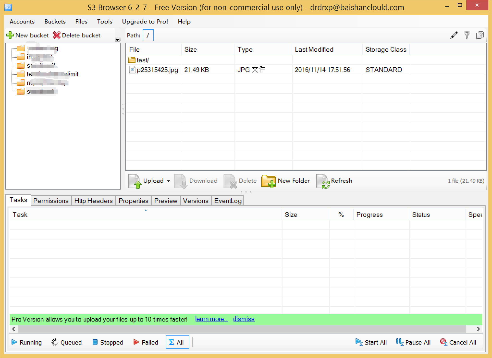
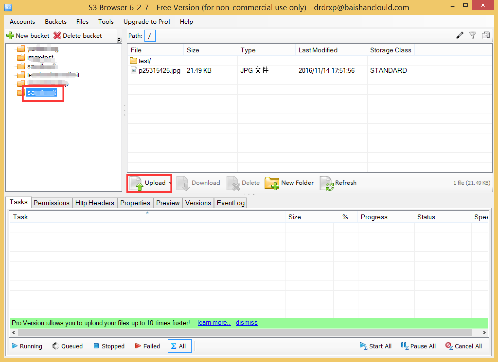
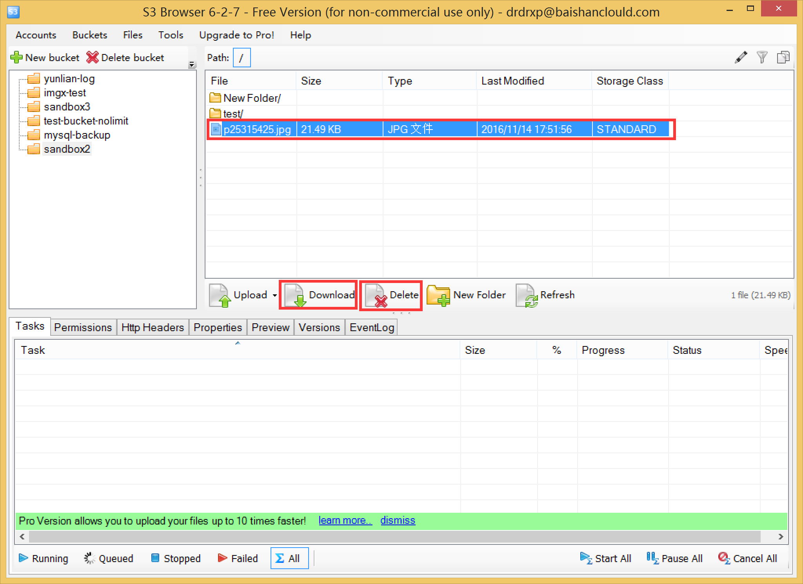

#  Windows下利用S3 Browser对接白山存储上传文件的步骤

##  第一步

打开S3 Browser软件，界面如下图所示:

## 第二步
点击Accounts下的Add New Account，弹出如下界面，注意Storage Type选择S3
Compatible Storage，REST
Endpoint填ss.bscstorage.com。输入账号、AccessKey和SecretKey就可以点击添加一个新账户了。

## 第三步

添加新账户之后就可以看到Storage里面的内容了。选中左边的某个bucket，就可以点击Upload向这个bucket里上传文件。

## 第四步

选中左边的某个bucket，点击New Folder可以向这个bucket里新建文件夹。

## 第五步

选中某个文件，点击Download和Delete可以下载和删除文件。

## 第六步

您还可以点击Buckets菜单下做新增Bucket等一系列操作。
至此，您就学完了利用S3 Browser对接白山存储上传文件的所有过程啦。

S3 Browser下载地址: [s3-browser](http://s3browser.com/)
